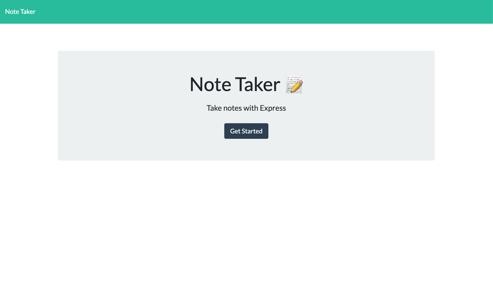
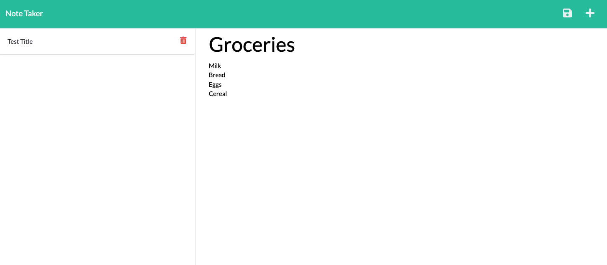
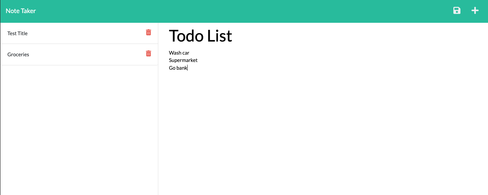
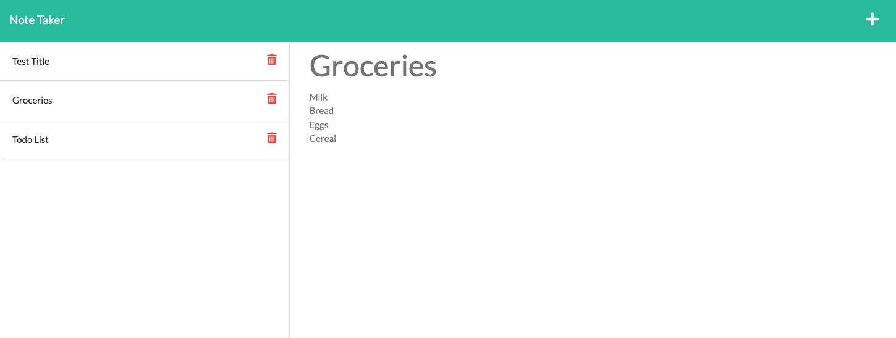
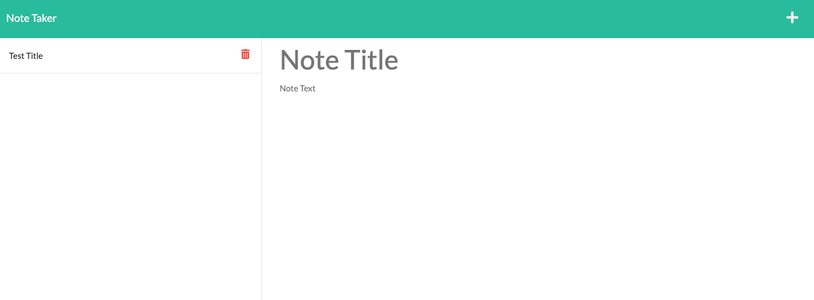

# Note Taker

## Table of contents

- [Description](#description)
- [Installation](#installation)
- [Usage](#usage)
- [Contributing](#contributing)
- [Tests](#tests)
- [License](#license)
- [Deployed application](#deployed-application)
- [GitHub repository](#github-repository)
- [Questions](#questions)
- [Screenshot](#screenshot)
- [Demonstration Links](#demonstration-links)

## Description

I have been tasked to modify starter code to create an application called Note Taker that can be used to write and save notes. This application will use an Express.js back end and will save and retrieve note data from a JSON file.

## Installation

Step 1 -
Clone repository link into terminal
https://github.com/riz1ash786/note-taker

Step 2 -
Open terminal and install node modules using the following command `npm i`

## Usage

Step 3 -
Enter `node server.js` in terminal to start the application. Once a port has been presented in terminal then type `localhost:3000` into browser to display the application locally. Alternatively, use the Heroku link provided in the links section below.

## Contributing

There are no contributing guidelines at this moment in time. Please check back in the future.

## Tests

No test specified as of yet.

## License

  
License Name: MIT  
License Link: [MIT](https://opensource.org/licenses/MIT)

## Deployed Application

https://powerful-atoll-97832.herokuapp.com/notes

## GitHub Repository

https://github.com/riz1ash786/note-taker

## Questions

If you have any additional questions then please get in touch via github or email. Thank you.

- Github - https://github.com/riz1ash786
- Email address - riz1ash786@gmail.com

## Screenshot

Homepage

Create new note

Create multiple new notes

Recall previously saved notes

Delete notes

## Demonstration Links

- HD link via google drive

https://drive.google.com/file/d/1RfD-i8WtvatQx1ppiIlFX4Y1xz5i83nX/view?usp=sharing

- Video demo

https://user-images.githubusercontent.com/93995881/158031642-e61dab39-1c70-45b9-86e1-5102ea6332f5.mov
